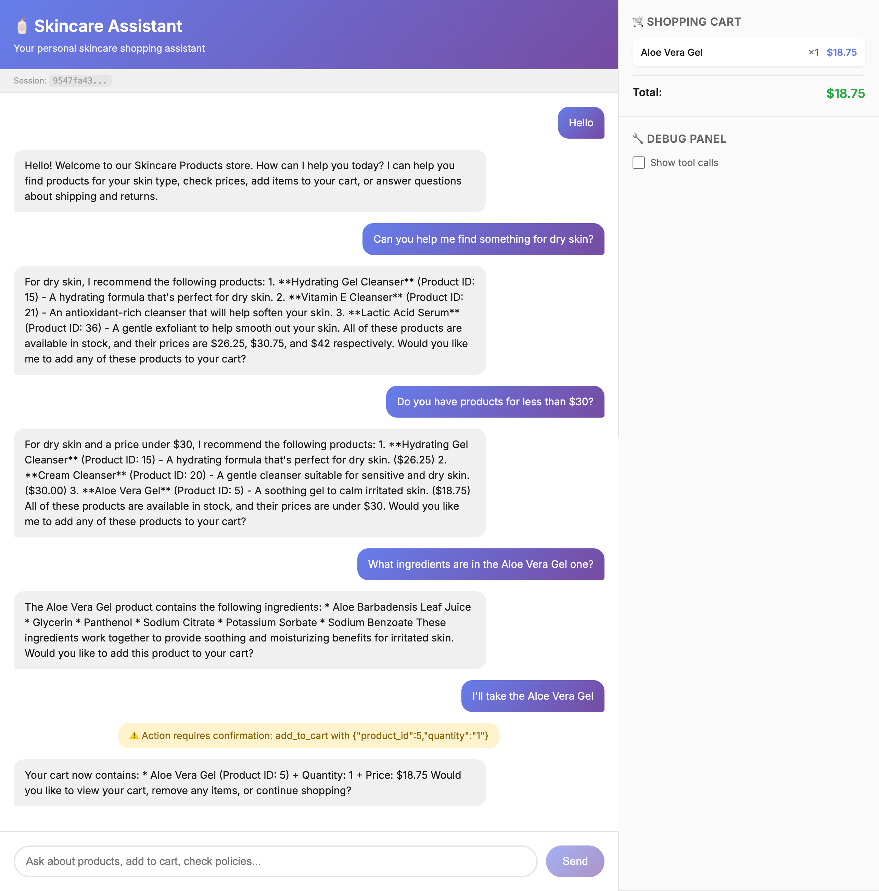
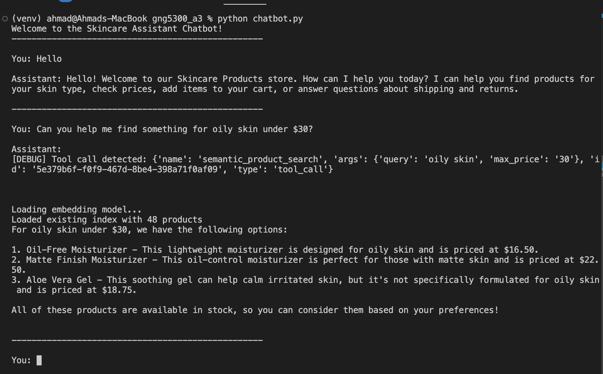

# 🧴 Skincare Shopping Assistant Chatbot


A skincare product shopping assistant built with **LangGraph** and **Ollama** (powered by the Llama 3.2 model). Features semantic search powered by vector embeddings to help customers find products based on their skin concerns.

Available as both a **Command Line Interface (CLI)** and a **React Web Application**.

<p align="center">
  
</p>

---

## ✨ Features

- 🔍 **Semantic Product Search** - Find products by describing skin concerns (e.g., "something for oily skin")
- 🛒 **Shopping Cart** - Add/remove products with confirmation dialogs
- 💰 **Price Filtering** - Search within budget constraints (e.g., "under $25")
- 📋 **Policy Information** - Shipping, returns, and payment details
- 🔧 **Debug Mode** (Web) - View all tool calls and LLM interactions


A **draft report** explaining the design and implementation of the basic LangChain graphs has been provided in the repository as [`docs/A3_Report.pdf`](docs/A3_Report.pdf). You may also access the report via the following [Google Docs link](https://docs.google.com/document/d/1phvv-uX34RrG9w8Xt4ZW_MiRagiqWRdcWMDiYbSb778/edit?usp=sharing).

---

## 🔧 Prerequisites

### 1. Install Ollama

Download and install Ollama from [ollama.com](https://ollama.com)

Then pull the Llama 3.2 model:

```bash
ollama pull llama3.2:3b
```

> ⚠️ **Note:** Requires approximately 16GB of RAM

### 2. Python 3.9+

Ensure you have Python 3.9 or higher installed.

### 3. Node.js (for Web Frontend only)

Required only if using the React frontend. Download from [nodejs.org](https://nodejs.org)

---

## ⚙️ Initial Setup (Required for Both Options)

Run these steps before using either the CLI or Web Frontend.

### Step 1: Create and Activate Virtual Environment

```bash
python -m venv venv
source venv/bin/activate  # macOS/Linux
# venv\Scripts\activate   # Windows
```

### Step 2: Install Python Dependencies

```bash
pip install -r requirements.txt
```

### Step 3: Initialize the Database

```bash
python setup.py
```

### Step 4: Build the Vector Search Index

```bash
python vector_search.py
```

This creates embeddings for all 48 products to enable semantic search.

---

## 💻 Option 1: CLI Chatbot

The simplest way to interact with the assistant directly in your terminal.

```bash
python chatbot.py
```

<p align="center">
  
</p>

### Example Queries

- "Show me products for dry skin"
- "I need a moisturizer under $30"
- "Add product 5 to my cart"
- "What's in my cart?"
- "What's your return policy?"

---

## 🌐 Option 2: Web Frontend (React)

A full-featured web interface with real-time cart view and debug panel.

### Terminal 1 - Start the API Server

```bash
source venv/bin/activate
python api.py
```

The API will run on `http://localhost:8000`

### Terminal 2 - Start the React Frontend

```bash
cd frontend
npm install
npm run dev
```

### Open in Browser

Navigate to **http://localhost:5173**


## 🛠️ Troubleshooting

**Ollama not found**: Make sure Ollama is installed and running (`ollama serve`)

**Port 8000 in use**: Kill existing processes: `lsof -ti:8000 | xargs kill -9`

**Slow first response**: The vector search model loads on first query; subsequent queries are faster

